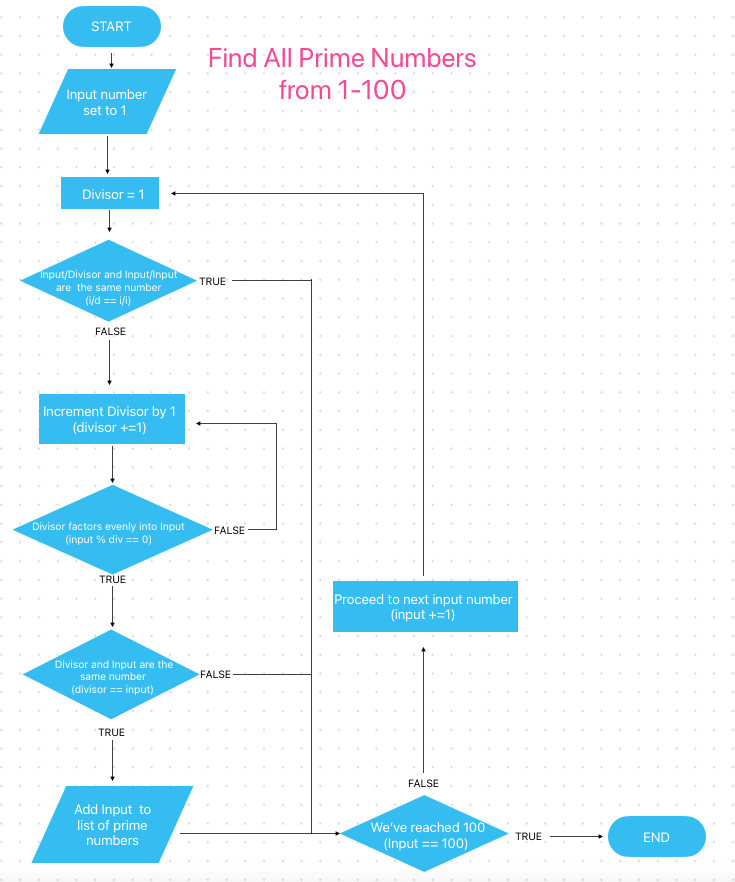

# Q1

> Identify and explain common and important components and concepts of web development markup languages.

Markup languages are essential to software development and can be found in many contexts. These range from simple readme documents to the HTML documents that define the structure and content of the web. While HTML is not the only web markup language (other notable examples include XML and XHTML) it is the most prevalent. $^1$

Broadly speaking, web markup languages have two important characteristics: they provide an annotated language that can be actionably parsed by web browsers and also maintain human readability. This results in a language that can provide vast amounts of information to a browser while retaining the ability to present its raw content meaningfully to the average human reader. $^2$

HTML (or hypertext markup language) was conceived and written by Tim Berners-Lee in 1990 as an integral language essential to the burgeoning World Wide Web.$^3$ Most notably its hypertext enables users to navigate seamlessly to linked pages and content via associated hyperlinks.

After defining the document type that a browser can expect to render ( `<!DOCTYPE html>`) we move to the two main structures of an html file, contained within the `<html> </html>` tags. These structures are the `<head>` and the `<body>` of the document.
The head contains metadata for the browser such as the document title, linked stylesheets and javascript scripts (deferred), language, viewport settings and other linked resources such as frameworks, font libraries and icons.

HTML markup utilizes tags to separate elements specific to rendering content by the browser but not intended to be seen by the end user. Tags are denoted by the `<` and `> `symbols. Most tags have opening and closing counterparts, using the `/` character to denote a closing element (ie `</TAG>`). The resulting tag structure generally takes this format:
`<TAG>Content</TAG>`.

The body contains the content and structure that is intended to be seen by the end user. This content is laid out within different tags to indicate content type, meaning and provide further functionality. Some tag types include paragraphs, hyperlinks, ordered and unordered lists, buttons and forms. Some of these tags nest other specific tags to create more specialized and intricate structures. One example is that of an anchor tag `<a></a>` which accepts a url or file path to link content as a hyperlink. Another is a form which utilizes `<input>` tags that have a myriad of different definable input types, each with its own input fields and validation functionality.

In more recent years HTML has seen a shift towards using semantic tags, moving away from the ubiquitous `<div>` and `<span>` tags from days of yore. Semantic tags are meant to convey meaning and intent (eg. `<nav> <figure> <aside>`). One important benefit of semantic tags are their role in aiding users with accessibility issues using screen readers and other assistive technologies. Ultimately semantic tags provide the twofold benefit of creating more intelligible code and making the internet a more inclusive space for all.

$^1$ Kyrnin, Jennifer. "What Are Markup Languages?" ThoughtCo, Jul. 31, 2021, thoughtco.com/what-are-markup-languages-3468655.

$^2$ “HTML Reference - HTML: Hypertext Markup Language: MDN.” HTML: HyperText Markup Language | MDN, https://developer.mozilla.org/en-US/docs/Web/HTML/Reference.

$^3$ Craig, William. "History of the Internet", webfx, Aug. 31 2022,
https://www.webfx.com/blog/web-design/the-history-of-the-internet-in-a-nutshell/

<br />
<br />

# Q2

> Define the features of the following technologies that are essential in terms of the development of the internet:
>
> - packets
> - IP addresses (IPv4 and IPv6)
> - routers and routing
> - domains and DNS
>
> Explain how each technology has contributed to the development of the internet

Packet technology enables internet users to send vast amounts of data globally with limited interruptions and congestion. When sending large messages and files over networks congestion can occur as a result of routes being unavailable while the transfer is taking place.$^1$ This manifests either in subsequent data having to wait for its completion, or take significantly circuitous routes to reach its destination. This problem was ameliorated by implementing the use of data packets and packet switching. This technology breaks up large messages and files into smaller, more manageable packets, allowing them to travel more efficiently over multiple routes to end up at the same destination. To then reconstitute these packets the transfer relies on transfer protocol information (eg. UDP, TCP), which is included in the header of the transfer and requests a port to transfer the packets data to on arrival. UDP does not return a confirmation of receipt to the sender. This has the benefit of not taking up extra network bandwidth but the short coming of not notifying the sender as to whether the transfer was received successfully. When it is imperative that a package is received in whole TCP, or transmission control protocol is implemented instead. One main difference between TCP and UDP is that TCP sends an acknowledgment of receipt to its origin destination. Applications such as email and direct messaging implement TCP as it's imperative that the entire uncorrupted message is received and reconstituted, whereas scenarios in which speed trumps precision such as voice over internet programs (VoIP) and multiplayer games UDP is implemented as acknowledgement of receipt is less important than speed. In both scenarios the transfer is then validated with a checksum; the sum of all the data packets transferred, which is included in the transfer header, and then subsequently checked against the sum of the received packets.

IP addresses were introduced in 1983 by the US Military's ARPANET as part of the tcp/ip protocol. They ensure every computer that is to be connected to a network is assigned a unique identifier. IP addresses facilitate tcp/ip packet transfers, ensuring disparate packets that have travelled over multiple routes end up at the intended destination where they are reassembled to their original state. IPv4 (or Internet Protocol Version 4) is the current version in use, but is reaching a point of inflection as the available pool of addresses is near exhausted. This is the result of the ubiquity of internet connected devices, not limited to computers, smart phones and tables but the vast amounts of Internet of Things(IoT) devices as well. The anticipated solution is the implementation of IPv6 which uses a 128bit address, as opposed to IPv4's 32bit address structure. This creates a pool of 340 billion billion billion addresses, versus IPv4's comparatively paltry 4.3 billion addresses. However, the transition from IPv4 to IPv6 is complicated and requires many challenges to be met before it can successfully be implemented. $^2$

Routers are devices that act as connection points facilitating the sending and receiving of packets. Routers comprise both LANs(local area networks) and WANs(wide area networks), where they are sometimes referred to as nodes. $^3$ In a home a router serves to supply wifi internet to connected local devices. In a WAN routers are responsible for receiving and forwarding packets on their path to their final destination. Routing is organized by a routing table which proscribes the path a packet will travel on its way to its destination. This path can be either dynamic or static as well as have varying levels of security protocols and priority implemented. As the packet passes through each router its address is added to the packet to create a source route. This creates a 'travel log' and can be helpful in locating errors should they occur.

Website addresses are comprised of an IP address followed by a port number. 1984 saw an effort to make these addresses more human readable via the implementation of domains and the domain name system (DNS). Domains are what we recognize as modern Internet addresses such as facebook.com, whitehouse.gov and unitednations.org. The DNS is a directory of servers in which all of the domain names are stored with their corresponding IP addresses. It is like the yellow pages of the Internet. $^4$ Every time a domain is requested to be served the browser makes a request to the DNS to direct the user to the associated stored ip address. This allows users to type a familiar name into a browser versus having to remember a 32bit IP address and port number.

$^1$ History of the Internet, William Craig, 8/12/2022,
https://www.webfx.com/blog/web-design/the-history-of-the-internet-in-a-nutshell/

$^2$ “What Is ipv4?” BlueCat Networks, 31 Aug. 2022, https://bluecatnetworks.com/glossary/what-is-ipv4/.

$^3$ Network Infrastructure: Routers and routing: Computer Science Department, University of Cape Town https://www.cs.uct.ac.za/mit_notes/web_programming/html/ch07s05.html

$^4$ The Internet: Crash Course Computer Science #29 https://www.youtube.com/watch?time_continue=348&v=AEaKrq3SpW8&source_ve_path=MzY4NDIsMzY4NDIsMzY4NDI&feature=emb_logo

<br />
<br />

# Q3

> Define the features of the following technologies that are essential in terms of the development of the internet:
>
> - TCP
> - HTTP and HTTPS
> - web browsers (requests, rendering and developer tools)
>
> Explain how each technology has contributed to the development of client and server communication over the internet (50 - 150 words for each technology)

### TCP

In 1974 a proposal was put forth to link a group of computers together in a decentralized network.To facilitate this 'inter-network' TCP, or transmission control protocol, was proposed as a way to regulate communication between machines.$^1$ TCP is a way to send and receive data securely and reliably over sometimes unreliable and unstable networks.$^2$ TCP uses TCP segments (or packets) to break up data and transfer over various routes.
It also implements technologies to ensure secure connections, confirmation of receipt and segment re-ordering when necessary. A three way handshake ensures secure communication and a header attached to the data payload enables checksum data validation, reordering, confirmation receipt of segments and routing log. TCP is responsible for creating reliable and stable channels over which network applications can communicate, forming the basis for file transfers, email and web browsing. Take for example the familiar act of browsing the web: HTTP, the protocol for requesting and receiving web pages and data, requires a reliable connection and depends on TCP to establish secure connections and to transfer request/response pairs.$^3$ TCP is the technological bedrock that facilitates the unfathomable amount of client/server data transferred daily.

### HTTP and HTTPS

HTTP, or Hyper Text Transfer Protocol, is an extensible protocol that governs all exchanges of data on the web.$^3$ It is a client-server process and is always initiated by a client. This is a process that occurs anytime a website is queried; a tcp connection is established, a clients user-agent(typically a web browser) will send a get request for a specific URI or URL (a web address) and after passing through a number of proxies a server will deliver a response in the form of a status message and if successful will serve the requested resource.$^4$ HTTPS is HTTP with added security features. It implements Transport Layer Security (previously SSL) to encrypt and verify requests, creating a secure client-server interaction. HTTPS is crucial for users to safely access servers for banking, e-commerce, transferring sensitive medical as well as general web security and privacy. (5) HTTP requests occur every time a client attempts to access, edit or update a web resource. These take the forms of GET, POST and PATCH requests respectively and occur for every instance a user navigates to a web resource or requests to view, delete, create or alter a resource. This is the protocol that takes place for every single client/server interaction.

### Web Browsers and Developer Tools

Web browsers are applications that have a great deal of functionality, namely making client requests to servers using HTTP and rendering and displaying the server response. After a browser makes a request to a server and successfully receives a response it is then tasked with rendering the response. There are many elements a browser then interprets and renders: the content and structure provided in HTML documents, styling and layout from a CSS file, interpreting the logic supplied by a JavaScript file or embedded code as well as fetching and utilizing any linked resources including images, fonts, icons, videos and pdfs. Browsers will often supply a suite of developer tools that are invaluable when developing web sites and applications. They can display every element of a website including HTML, CSS, JavaScript as well as DOM, http status codes, network and session information. The importance of web browsers to modern client-server interactions is almost so gargantuan we take it for granted, like the air we breathe or the clean water that flows from our taps on demand. It provides great convenience, available on pretty almost any modern computing device, and is a far cry from the days of usenet, America Online, BBS and other antiquated means of accessing the internet to communicate with fellow humans from around the globe.

$^1$ Craig, William. “The History of the Internet in a Nutshell.” WebFX, 12 Aug. 2022, https://www.webfx.com/blog/web-design/the-history-of-the-internet-in-a-nutshell/.

$^2$ Sookocheff, Kevin. “How Does TCP Work?” Kevin Sookocheff (Alt + H), 15 May 2019, https://sookocheff.com/post/networking/how-does-tcp-work/.

$^3$ “An Overview of HTTP.” MDN, https://developer.mozilla.org/en-US/docs/Web/HTTP/Overview.

$^4$ "MDN: A typical HTTP session." MDN, https://developer.mozilla.org/en-US/docs/Web/HTTP/Session

$^5$ Why Is HTTP Not Secure? | HTTP vs. HTTPS . https://www.cloudflare.com/learning/ssl/why-is-http-not-secure/.

<br />
<br />

# Q4

> Identify THREE data structures used in the Python programming language and explain the reasons for using each.

### **List**

A list is a comma delimited collection of objects contained within square brackets: `my_list = [1, 2, 3]`.$^1$ Its contents can be any data type and can be heterogeneous; multiple data types can be contained within the same list. `my_list = [1, 2, 3, 'Cat', 3.14]`. A list can even contain other lists or dictionaries: `my_nested_list = [[1,2,3], [5,6,7]]`
It is indexed, has length and has a host of built-in methods accessible to alter or manipulate its contents. Lists are mutable, meaning their contents can be modified, reassigned and sorted. Additionally lists can have elements removed, inserted, concatenated and appended. They are also iterable, which means they can easily be used in loops:

```Python
my_list = [1, 2, 3]
for el in my_list:
    print(el)
```

Since a variable can only store one value at a time, a list is well suited to store collections of related(or unrelated) objects which can be accessed from the same variable. They can then be manipulated and acted upon relationally as a single data structure. One common use case is utilizing a list to contain a collection of dictionaries:

```Python
People = [
{'person1': 'Bobby'},
{'person2': 'Jimmy'},
{'person3': 'Jamey'}
]
```

This collection of people can now be iterated over and acted upon as a single data structure containing a group of related elements.

### **Tuple**

A tuple is a comma delimited collection of elements contained within parentheses:

```
my_tuple = (1, 2, 3, 'A', 'B', 'C')
```

It is extremely similar to a list with the main difference being that it is immutable; it cannot be altered, manipulated or have elements reordered, added or removed.$^1$ It is also indexed, has length and is iterable.
Tuples are used when a list data structure is required but its contents are not intended to be altered. If a developer needs to manipulate a tuple there are built-in functions that help to facilitate this. The tuple() and list() functions serve to convert the passed in argument to their respective data types:

```Python
print(list((1, 2, 3)))
```

would yield:

```
>>> [1, 2, 3]
```

To leave a list or tuple intact before manipulating its contents the `copy()` function can be called to duplicate it. This creates a completely new data instance with a unique reference ID from the original, which can then be converted to a list and mutated in any number of ways.$^1$
A tuple is not only implemented to shield contents from alteration but also to signal to other developers the intent and spirit of its intent that the data should remain undisturbed:

```Python
the_beatles = ('John', 'Paul', 'George', 'Ringo')
```

### **Dictionary**

A dictionary in Python is a collection of key/value pairs that are comma delimited and contained within curly braces:

```Python
person = {
'name': 'John',
'height': 190,
'age': 54
}
```

Dictionaries are unordered which means they cannot be accessed by index values, however they are iterable and later versions of Python will store the order in which their key/value pairs were originally formatted.$^2$ Dictionaries are particularly useful when modeling data structures on real life objects and people as seen in the previous example. Their paired values can be represented by any data types or structures available in the Python language. This gives dictionaries great flexibility and detail when modeling both abstract data and real life people, places and things.

$^1$ Sweigart, Al. “Automate the Boring Stuff with Python: Dictionaries.” Automate the Boring Stuff with Python, https://automatetheboringstuff.com/2e/chapter5/.

$^2$ Sweigart, Al. “Automate the Boring Stuff with Python: Lists.” Automate the Boring Stuff with Python, https://automatetheboringstuff.com/2e/chapter4/.

<br />
<br />

# Q5

> Describe the features of interpreters and compilers and how they are different.

All programming languages are written in high-level language that humans are capable of reading and understanding, however computers operate only using low level binary languages such as machine instruction or assembly language. An intermediary process is needed to convert the high level programming language into a low level machine language.$^1$ This is where interpreters and compilers enter the picture. They are programs written in a high-level language that parse and re-write the code to be executable by machines. Compilers and interpreters can be written in the same or different language as their target files (eg. a Java file being compiled by a program written in Java OR in C) ( 2.)

A **compiler** is a program that takes a target file as an input then checks for lexical, semantic and syntactical accuracy, parses and optimizes the instructions within to output a completed file written in a low level machine language. This output is specific to a targeted computing architecture such as iOS or Intel Pentium architecture and is not universally readable between different machine architectures. $^1$ One example of a compiled language is C. Developed in the early 1970's with an aim to build operating systems and other applications that interact closely with a machines processing architecture, C programs must be compiled by a separate compiler in order to run.  There are a great many compilers available that will compile C programs for many different system architectures. Because C is compiled before run time it can yield extremely fast and efficient programs.

An **interpreter** is a program that takes a target file as input and interprets the code line by line, every time the program is executed. This allows source code to be more universally usable between different machine architectures, but has the disadvantage of being significantly slower than a compiler. One of the most common interpreted languages is JavaScript - the programming language of the web.$^3$ Javascript (among others) utilizes Just In Time compilation, meaning it is not compiled before being deployed but is interpreted at run-time. In the context of the client-server model it has the benefit of freeing up server side resources and allowing the user to download the script as part of an HTTP request. The browser then interprets and executes the script locally, ultimately creating a much faster and more seamless web experience.

$^1$ Compilers: Principles, Techniques, and Tools by Alfred V. Aho, Ravi Sethi, Jeffrey D. Ullman - Second Edition, 2007

$^2$“What Is a Compiler?” What Is a Compiler?, University of Texas Arlington, 20 Jan. 2015, https://lambda.uta.edu/cse5317/notes/node3.html.

$^3$ “Intro to Javascript.” Introduction to Javascript, Stanford University, https://web.stanford.edu/class/cs98si/slides/overview.html.

<br />
<br />
 
# Q6

> Identify TWO commonly used programming languages and explain the benefits and drawbacks of each.

### Python

Python is an open source, high level programming language developed by Guido van Rossum and released in 1991. It is approachable for beginners to learn thanks to a straightforward syntax, dynamic typing and robust built-in library.$^1$ The Python developer community is extremely active which results in a great deal of resources available to new developers learning the language. There are also extensive open source external modules and packages that can be imported to extend Pythons functionality. It lends itself to different programming paradigms including procedural and Object Oriented Programming. Python is used in a wide array of applications; data analysis, scientific and web applications and perhaps most notably machine learning and artificial intelligence. Creating programs in Python can be swift, making it well suited to Rapid Application Development.$^2$  
Some drawbacks of Python could be seen as a direct result of its strengths, and are most notably experienced relating to speed and memory usage. Because Python is interpreted and dynamically typed its runtime compiler (Python virtual machine) has to validate every variable when running a program. Python is also not optimized for conservative memory usage, with a garbage collection process that is less efficient than many other languages.$^3$ Python is not tailored towards web and mobile applications or database intensive applications and does not support multi-threaded processing.

### C

The C programming language was created by Dennis Ritchie at Bell Labs in the early 1970's. C is a middle level language as it operates as both a high level programming language as well as more directly with low level instructions closer to machine instruction.(3) This makes C useful for writing programs that interface closely to a machines particular CPU architecture such as operating systems and drivers.$^4$ Some programs and operating systems written in C include Windows, Oracle Database, Git and the Python Interpreter. C is a compiled language, with many cross platform compilers available, meaning a broadly written C program is capable of running on many different machine architectures.$^5$  
Some of the drawbacks or challenges of C can be found in the area of memory management: memory allocation and garbage collecting must be handled manually which can result in memory leaks and other unwanted outcomes. The C compiler uses very few checks, placing the onus of avoiding errors or unexpected processes on the programmer. C also lacks Object and Class data structures making object oriented programming impossible.$^6$

$^1$ “What Is Python? Executive Summary.” Python.org, https://www.python.org/doc/essays/blurb/.

$^2$ Novotny, Jeff. “A Programmers' Guide to Python: Advantages &amp; Disadvantages.” Linode Guides &amp; Tutorials, Linode, 9 Mar. 2023, https://www.linode.com/docs/guides/pros-and-cons-of-python/.

$^3$ “C (Programming Language).” Wikipedia, Wikimedia Foundation, 27 Apr. 2023, https://en.wikipedia.org/wiki/C_(programming_language).

$^4$ Thompson, Barbara. “What Is C Programming Language? Basics, Introduction, History.” Guru99, 4 Mar. 2023, https://www.guru99.com/c-programming-language.html.

$^5$ Sagi, Sai Srija. “Types of Programming Language: Low, Medium, High Level with Examples.” EduKedar, 30 Sept. 2021, https://edukedar.com/types-of-programming-language/#.

$^6$ Ravikiran, A S. “The Difference between C and C++.” Simplilearn.com, Simplilearn, 12 Dec. 2022, https://www.simplilearn.com/tutorials/cpp-tutorial/difference-between-c-and-cpp.

<br />
<br />

## Q8

> Explain control flow, using examples from the Python programming language

Control flow is the order in which a computer program executes its code. Without any conditional logic, programming languages such as Python and JavaScript execute sequentially, line by line from top to bottom. This is acceptable when there is no need for conditional logic or dynamically changing variables:

```Python
def areaOfRectangle(length, width):
2       return length * width
3
4   print(areaOfRectangle(12, 16))
#prints 192
```

In this example we define the function areaOfRectangle first, we then invoke the function with hard coded values of 12 and 16. The code is executed sequentially and prints our result of 192.

In order to create dynamically controlled flow within a program we can implement conditional logic. The backbone of conditional logic is the ternary operator, or Boolean. A Boolean is either `True` or `False`, and combined with `else`, `elif` (else if), and `else` statements help to create more complex and flexible programs. With these structures we are able to control under which conditions certain blocks of code will be executed. With conditional logic introduced into our control flow the program ceases to have to execute sequentially:

```Python
def weatherSummary(isRaining):
    if isRaining:
        print("It's wet outside")
    else:
        print("Let's get out of the house!")

```

In this previous code example we are able to account for two different dynamic conditions: is it raining or not? For each unique condition we are able to control which blocks of code will be executed and pass over the code that does not pertain to our particular scenario.

We can combine and alter different conditional scenarios with Boolean Operators `and`, `or`, and `not`. The `and` and `or` operators are used to string together multiple conditional statements.

```Python
if isRaining and isCold:
    print('Stay inside, it is miserable out there')

if isSunny or houseOnFire:
    print('I think we should get outside.')
```

The `and` operator requires both conditionals evaluate to true, while the `or` operator requires just one condition (or more) to evaluate to true.

The `not` operator negates any proceeding statement:

```Python
1   isRaining = False
2
3   if not isRaining:
4       print('I will not need an umbrella today!')

```

This double negative of 'not false' results in a True evaluation to let us know it will not be raining in the near future.

Understanding and controlling the flow of a program is essential to creating useful and powerful code able to conform to various dynamic conditions. It also creates more efficient code that can avoid running unneeded or superfluous blocks of code for a given scenario.

<br />
<br />

# Q9

Both type coercion and type conversion act to change the data type of a given object. The main difference between the two is the nature of the catalyst that initiates the conversion: type coercion is usually implicit, whereas type conversion is always explicit.$^1$  
Python utilizes both type coercion and type conversion. Some examples of type conversion in Python can be found in the `int()`, `float()`, `str()`, `list()` and `tuple()` functions. When invoked these functions will convert a given argument to a specified data type (integer, float, string, list or tuple, respectively). This conversion happens only when the function is invoked and passed an argument, making it an explicit action. One use case of type conversion can be found in accepting a number input from an input prompt. The `input()` function automatically casts any input as a string. To use this input in a mathematical expression it must be converted to a numerical type:

```Python
#input is automatically cast as a string:
userInput = input('Type a number ')
# Converts input to an integer (type conversion). Stores result new variable:
userInputInteger = int(userInput)
# Now math can happen:
incrementInput = userInputInteger + 1
```

An example of of type coercion in Python can be found in an f-string: Python will accept a string with interspersed expressions contained within curly braces. These expressions will be evaluated, coerced into a string and finally interpolated into the resulting string - an implicit change of data type.

```Python
#Declare a variable with an integer value
luftballons = 99
#F string will implicitly convert our variable to a string without us having to invoke str() function:
nenaSings = f"{luftballons} red ballons, floating in the summer sky"
```

$^1$ Type Coercion: MDN Web Docs https://developer.mozilla.org/en-US/docs/Glossary/Type_coercion

<br />
<br />

# Q10

> Explain data types, using examples

Because a computer cannot differentiate variable types and the ways they can and cannot be stored and used data types are implemented within programming languages.$^1$ Data types dictate how a variable operates within a language. When a mismatched data type is introduced to a program a type error is thrown, preventing further executinion of the code. This helps catch statements such as `3 + True`. There are many data types including; integer, string, Boolean, void and date. Different data types will dictate how seemingly similar variables will be acted on with the same operator:

```
1 + 1 = 2
```

1 + 1 results in the expected sum of 2 after a mathematical operation as the data types are integers. However, if we wrapped our numbers in quotes making them strings we would have a totally different result:

```
'1' + '1' = '11'`
```

### A few examples of data types in Python:

**Numeric types** encompass three subtypes: **int, float** and **complex**.$^1$

- An int represents an integer: a whole number without a fractional component, either positive or negative. `eg. 1, 8, -16, -256`
- A float represents any number, positive or negative, that has a decimal with a fractional component.
  `eg. 1.2, 2.4, 3.14159, -10000.00001`
- Complex numbers represent imaginary numbers comprised of a number and an imaginary part denoted with a j.$^2$.

While these three numerical data types are distinct, Python allows for mixed arithmetic between them and will automatically adjust type to match width of the widest element within an expression.

eg. `1 + 1.5 = 2.5` will be internally adjusted to `1.0 + 1.5 = 2.5`.

Why not just have one numerical data type? Storing unneeded fractional or imaginary information is costly both to memory and processing speed so it is best to allocate those resources only when necessary.

Numeric types are used strictly to represent values and for implementation in mathematical contexts. For a numerical symbol to be used in a string statement it must be converted to a string type first.$^3$

**Strings** are an indexed list (or array) of unicode characters contained within either single `` ' `` or double `"` quotation marks. Strings are typically used to represent words, sentences and phrases. They are zero-indexed, have length and their contents can be accessed using bracket notation like any array.:

```
myString = "Hello, world!"
firstLetter = myString[0]
print(firstLetter) # prints 'H'
```

Strings are essential to programming language as they introduce meaning and human readability to code. They allow us to store, manipulate and make use of the most familiar and universal type of human communication and expression.

The **Boolean** is named for English mathematician George Boole.$^4$ It is used to represent two states: True or False. Booleans are essential in programming as they are the basis of control flow structures and conditional logic. They are particularly useful in computer science as their True/False structure is analogous to a computers Binary language: 1 or 0, True or False.$^5$
A simple example of a boolean used in a control flow:

```Python
isRaining = True  #Assign isRaining variable to Boolean True

if isRaining:  #Checks if it is raining outside to control the flow of the output phrase.

    print("Stay inside or you will get wet") # If it is raining print to stay inside

else: print("Go out and play!")  #Otherwise it prints its safe to go outside and play.

```

$^1$ “What Is a Data Type?” Computer Hope, 31 Dec. 2022, https://www.computerhope.com/jargon/d/datatype.htm.

$^2$ Gaurav, Sushant. “Complex() in Python: Python Complex() Function.” Scaler Topics, Scaler Topics, 7 Mar. 2022, https://www.scaler.com/topics/complex-in-python/.

$^3$ “Python Numbers.” Python Numbers, https://www.w3schools.com/python/python_numbers.asp.

$^4$ Visentin, Lisa. “Who Is George Boole: The Mathematician behind the Google Doodle.” The Sydney Morning Herald, The Sydney Morning Herald, 2 Nov. 2015, https://www.smh.com.au/technology/who-is-george-boole-the-mathematician-behind-the-google-doodle-20151102-gkofyg.html#ixzz3qIcv6ii2.

$^5$ CS50 2019 Lecture 0 : Youtube https://www.youtube.com/watch?v=jjqgP9dpD1k&t=1s

<br />
<br />

# Q11

> Here’s the problem: “There is a restaurant serving a variety of food. The customers want to be able to buy food of their choice. All the staff just quit, how can you build an app to replace them?”
>
> - Identify the classes you would use to solve the problem
> - Write a short explanation of why you would use the classes you have identified

_NOTE: While I find the premise of a potential labor dispute being solved with automation and technology morally questionable and in direct conflict with the spirit of Question 7, I will assume the entire staff has won the lottery on a group ticket and no longer needs to work._

Creating an app to replace the entire staff of a restaurant would be tricky indeed. It would require functionality to cover front of house concerns; greeting and seating diners, taking and processing orders, checking on diners throughout meal (refill? more BBQ Sauce?) and running food from the kitchen to the diner when ready. Back of house concerns would require a huge amount of physical infrastructure to replace line cooks, chefs and food runners, not to mention handling and preparing ingredients. There is also the issue of sequencing incoming orders to make sure they are prepared and delivered as a set and in a timely fashion. There are the monetary concerns of accepting and processing payment; digital, bank cards and cash (cashless restaurants pose a problem as they exclude customers who are unbanked or too young have credit or debit cards)$^1$. There is also the issue of keeping track of stock of food ingredients and reusables (napkins, cutlery etc.) and keeping track of their inventory and expiry dates so they can be reordered before running out. Some classes I might employ to address these concerns when building the restaurant app:

### MenuItem:

This class encompasses the menu items offered to customers. It is the most forward facing class as it is the main attraction of any restaurant. It might include price, time offered(breakfast, lunch, dinner), is_featured_special, seasonal, alergen_information. This class must not only provide pertinent information about menu items but also contain some amount of enticement to attract customers to the menu item to inspire purchase.

```Python
menu_item = {
'name': String,
'price': float,
'is_featured_special': Boolean,
'seasonal': Boolean,
'description': String,
'ingredients': [String]
'allergen_information': [String],
'time_available': (breakfast, lunch, dinner)
}
```

### IngredientItem:

This is the class for inventory of recipe ingredients: the bulk stores of produce, salt, sugar, bread, meat etc. This class includes name, order delivery estimate, expiration dates, distributors, last ordered and perhaps most importantly quantity on hand. There might be methods to alert when stock is running low so restock can be ordered in time. Or methods to alert when a large quantity of an item is approaching expiry date so a special can be offered to ensure it is used before it goes bad. This class is imperative to know what ingredients are on hand and to keep necessary stock so menu items are always available.

```Python
ingredient_item = {
'name': ,
'cost': ,
'quantity': ,
'useby_expiration': ,
'distributors':,
'last ordered':,
'last_ordered_amount':,
method: reorder alert when low stock
method: create special item large quantity and sellby date is approaching
}
```

### ReusableItem:

This would be a class to cover all reusable items such as napkins, cutlery, takeout boxes and paper menus. Similar to the ingredient class it is important to keep track of reusable items so they do not run out and customers can dine in or take orders out without interruption or inconvenience.

```Python
single_use_supply = {
'quantity': ,
'distributor': ,
'cost': float,
'order_time': datetime,
environmental_green_score: int,
method: low qty alert, reorder
}
```

### CustomerOrder:

This class covers each instance of an order (covering a range of 1 or more individuals in a given party). It is essential to associate a customer, their payment information and their order details. This class might have an order number, time ordered, total order sum, items ordered (which would need an associated list of dictionaries to cover items to be associated with different party members and another for special requests and allergy information). Some methods included in this class might be order tracking, serve time estimate or bill splitting. This class is the main conduit between customer and restaurant and is integral to a functional restaurant apps success - customers have to be able to order and pay for items, and the process of preparation and delivery must be robust or there is literally no business model.

```Python
'customer_order' = {
'ordered_items': List,
'time_placed': DateTime,
'seating_position_sub_order': Dictionary,
'order_number': int,
'order_total': float,
'special_requests': Dictionary,

Methods: track_order_method()
when_available() method
order_confirmation() method
}
```

### Customer:

A customer class would act to store personal and contact information of customers. It would facilitate functionality to log order/visit frequency, repeat ordered items and guide targeted advertisement. It could store payment information and help create a more personalized experience for the customer.

```Python

customer= {
information: {name, address, email},
saved_payment_method: payement_method,
visit_log: frequency,
frequently-ordered_items: List
}
```

### CustomerReview:

This class would cover reviews of the restaurant to help with internal quality control as well as keeping the establishment competitive and profitable. It could also be useful in regard to advertising material. Classes could include food quality, customer experience, ambience etc all with an integer range. A fuller more verbose review section would also be a wise addition to the class.

```Python
customer_review = {
'dining_experience': Range
'star_rating': Range,
'food_quality': Range,
'service_quality': Range,
'would_recommend': boolean,
'review': string
}
```

### OrderInvoice:

This class would create a seperate order invoice for every transaction storing amount, time of transaction, payment method, party number and other financial details. It would serve a different function than CustomerOrder. CustomerOrder is concerned with food and dining concerns whereas OrderInvoice is tasked with storing the transactional dealings. Keeping these concerns seperate is helpful when collating information for total sales in a day, week, month, sales trends and other meta transactional analyses.

$^1$ McCart, Melissa. “The Problem with Cashless Restaurants.” Eater, Eater, 15 Feb. 2018, https://www.eater.com/2018/2/15/16974980/cashless-restaurants-credit-card-only-legal-problem-discriminatory.

<br />
<br />

# Q12

The code snippet below will not run because the `input()` function automatically stores user input as a string. Python will not coerce it to a number when attempting the mathematic expression  `(celsius*9/5)+32`. To test this we can invoke the `type()` function with `celsius` as an argument and it will confirm that it is a string. Because Python does not type coerce from string to float/int we will need to employ type conversion to convert the user input assigned to the celsius variable to a numeric type for the function to work as expected.

_one possible solution:_

```Python
celsius = float(input())

farehnheit = (celsius*9/5)+32

print(f"The result is: {farehnheit}.")
```

<br />
<br />

# Q13

```Python
arr = [5, 22, 29, 39, 19, 51, 78, 96, 84]

i = 0

while (i < len(arr) -1) and (arr[i] < arr[i+1]):
    i += 1
print(i)
indexCache = arr[i]
arr[i] = arr[i+1]
arr[i+1] = indexCache
```

<br />
<br />

# Q14



_Definition of Prime number: Any positive integer that is divisible by exactly two numbers only_ $^1$

- This is the process for each number from 1-100:
- Start with a divisor set to 1.
- Check to see if input number has _at least_ two unique factors:
  - input number divided by 1 & input divided by itself should yield two unique numbers.
    (this covers the edge case of 1).
  - If not two unique numbers the input is not prime, move to next input number.
  - If so proceed to next step.
- Increment divisor by one and check if it divides evenly into the input number.
  - If it does not: repeat the previous step (checking if input is divisible by any number other than 1 and itself.)
  - If it does:
    - If _divisor is less than the input number_: we have found a third factor which means number is not prime, move to next input number.
    - If _divisor equals input number_: we have proceeded through all numbers without finding any additional factors. This number has exactly two factors so we can add input number to list of Prime Numbers.
- Repeat this process for each number up to 100.

_One possible Python solution:_

```Python
prime_numbers = []

for num in range(1, 101):
    div = 1
    for div in range(1, num+1):
        if num/1 == num/num:
            break
        else:
            div += 1
            if num%div == 0 and num==div:
                prime_numbers.append(num)
            elif num%div == 0:
                break

print((prime_numbers))
```

$^1$ _Is One a Prime Number_: Wellington Faculty of Science: https://www.wgtn.ac.nz/science/ask-a-researcher/is-1-a-prime-number

<br />
<br />

# Q15

Python code block:

```Python
def weatherSummary(isRaining, temp):
    if isRaining and temp < 15:
        print("It's wet and cold")
    elif isRaining and temp >= 15:
        print("It's warm and raining")
    elif not isRaining and temp < 15:
        print("It's not raining but cold")
    else:
        print("It's warm but not raining")
```

<br />
<br />

# Q16

```Python
skills = {
    'Python' : 1,
    'Ruby' : 2,
    'Bash' : 4,
    'Git' : 8,
    'HTML' : 16,
    'TDD' : 32,
    'CSS' : 64,
    'JavaScript' : 128,
}

applicant_skills = []
skills_to_learn = []
applicant_score = 0

print('Enter programming languages known. Press enter when complete: ')

# Collect all skills from User and store in list:
while True:
    skill = input().lower()
    if skill == '':
        break
    else:
        applicant_skills.append(skill)

# Loop over skills dictionary to tally score of known languages and append unknowns to skills_to_learn
# Creating skills_to_learn list with keys from skills dictionary helps with cAsE formatting/matching for later logic.
for k, v in skills.items():
    if k.lower() in applicant_skills:
        applicant_score += v
    else:
        skills_to_learn.append(k)

print(f'Your overall coding skill score is {applicant_score}. Consider learning any of these languages to boost your score a bit!:')

# loop through skills_to_learn list and access corresponding skills dict items to display.
for skill in skills_to_learn:
    print(f"{skill} will add {skills[skill]} point{'s' if skills[skill] > 1 else ''}.")

print('Thank you for your interest in ACME Corporation!')


# This logic (47-49) could replace lines 39-40 and eliminate need for skills_to_learn list.
# It loops over skills dictionary, comparing keys to applicant skills to find skills missing.
# I ultimately opted for the skills_to_learn list approach as it creates a potentially shorter loop iteration (what if the skills dict grows to contain 100 key/value pairs?) as well as having another data point stored for each applicant.

# for k, v in skills.items():
#     if k.lower() not in applicant_skills:
#         print(f"{k} will add {v} point{'s' if v > 1 else ''}.")

```
