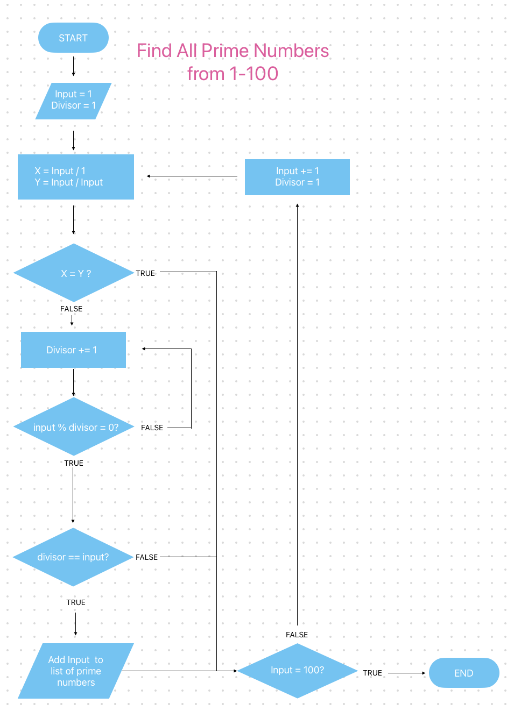

## Q14

*Definition of Prime number: Any positive integer that is divisible by exactly two numbers only* 1.

- Start with a divisor of 1.
- Check to see if input number has *at least* two unique factors:   
    - i/divisor & i/i should yeild two unique numbers.
    (this covers the edge case of 1).
    - If not two unique factors input is not prime, move to next input number.
- Increase divisor by one and check if it divides evenly into the input number.
    - If NO: repeat the previous step to check if input is divisible by any number other than 1 and itself.
    - If YES:
        - *If divisor < input number* we have found a third factor which means number is not prime, move to next input number. 
        -  *If divisor = input number* we have proceeded through all numbers without finding any factors. Add input number to Prime Number List.
- Repeat this process for each number up to 100. 

1. *Is One a Prime Number*: Wellington Faculty of Science: https://www.wgtn.ac.nz/science/ask-a-researcher/is-1-a-prime-number